# Course environment
The environment for the course: [practical machine learning](http://dataworkshop.eu)

There are at least two dimensions to how to setup the environment: *physical* and *logical*.

### Physical 
1. local machine (e.g. laptop)
2. cloud (e.g. [Google Cloud](https://github.com/dataworkshop/gcloud_setup) or [Amazon](https://github.com/dataworkshop/amazon_setup))
3. something between :D

### Logical
1. **bash script** - install one by one (e.g. by using bash script `setup.sh`)
2. **docker** 

## Bash script
1. Prepare a machine (the script have tested on Ubuntu 16.04)

*Note*. Example, how to setup GCC.
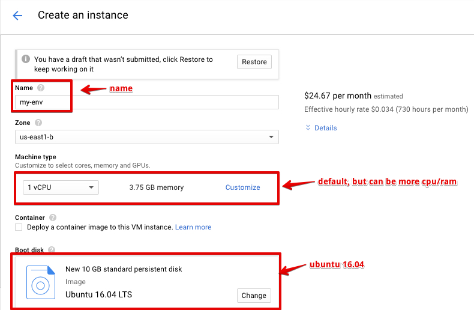
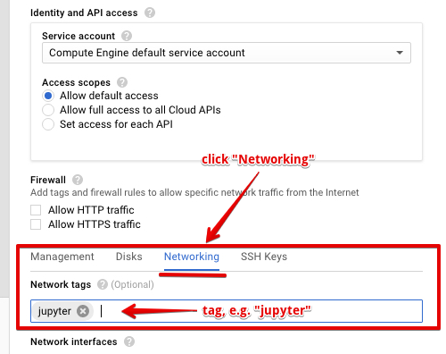
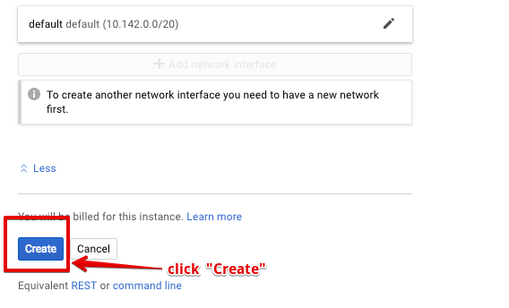

### Firewall Rules

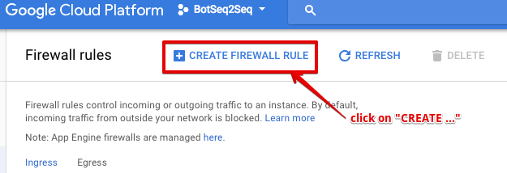
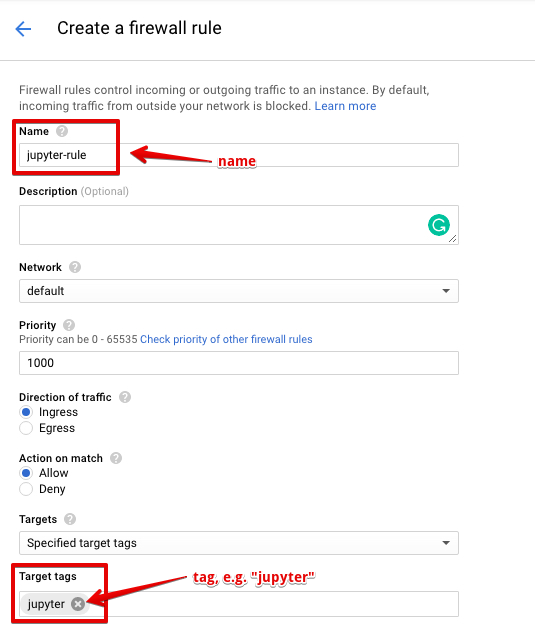
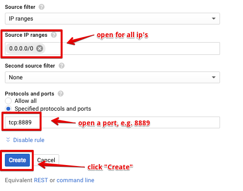

2. Log in to the machine via ssh

Here is an example how to quick login via ssh on GCC.
*Note* your machine should be running.

Wait some time (up to 10 secs).
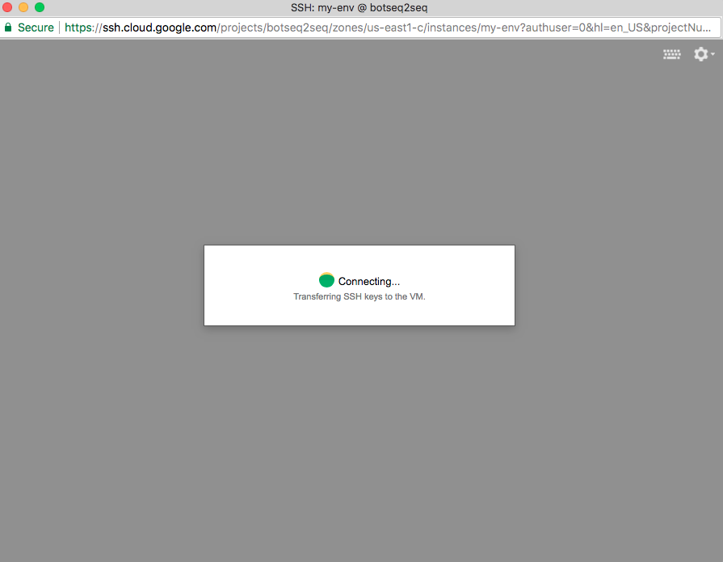
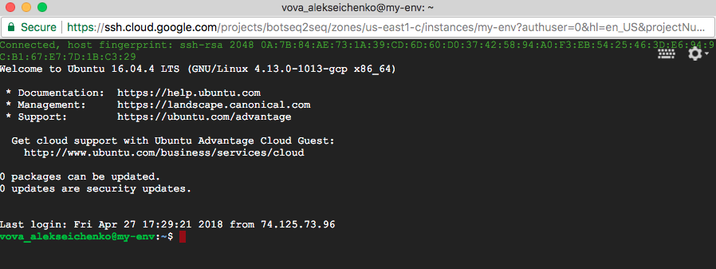
3. Download bash script: `wget https://raw.githubusercontent.com/dataworkshop/course_env/master/setup.sh`

4. Run it: `bash setup.sh`
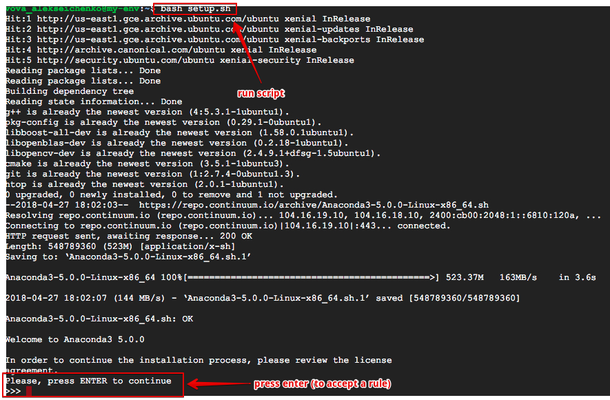
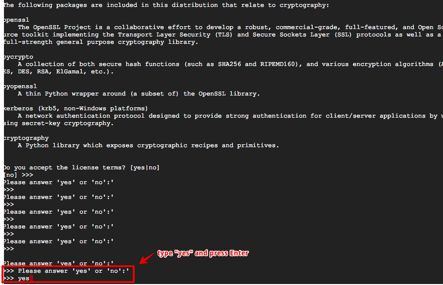

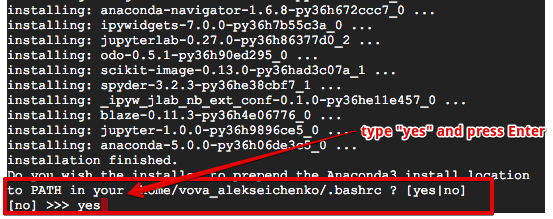
5. It took some time (be patient)
6. Test it (e.g. type in the console `ipython`)

7. Be happy :)

## Jupyter
To run jupyter you should remember about few things:
1. first of all open a port (e.g. 8889). You can find some details how to open ports for [Google Cloud](https://github.com/dataworkshop/gcloud_setup) or [Amazon](https://github.com/dataworkshop/amazon_setup)
2. You need run jupyter's process in the smart way (when you log out, then the juypter's process still should exist). For this you can use e.g. [screen](https://kb.iu.edu/d/acuy). When you type: `screen -S jupyter` you will create a session. After you you can run some command there. To detach session: `CTRL + A + D`. To attach: `screen -x jupyter`. *Note*, `jupyter` it's just a name for this case, it can be something else (e.g. `elephant`).
3. To run jupyter's notebooks, type this command: `jupyter notebook --no-browser --port 8889`. Remeber about token.

## Docker [latest]

Pull or build docker images:
1. `docker pull dataworkshop-env`
2. `docker build -t dataworkshop-env .`

### Run docker container:
1. `docker run -d --name dataworkshop-notebook -v /path/to/modules/:/home/workspace/modules/ -p 8888:8888 dataworkshop-env`

#### Check token:
2. `docker logs dataworkshop-notebook`

### Open browser and goto:
`localhost:8888` or another remote host address
